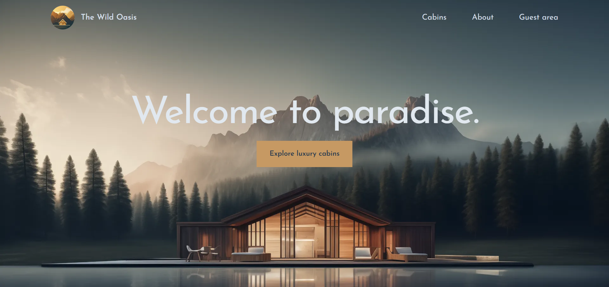

# 🏝️ The Wild Oasis (Customer Website)

A server-side rendered, customer-facing application for "The Wild Oasis" resort. This app allows guests to browse cabins, sign in via Google, and manage their reservations.

 

## 🔗 Live Demo

**[Click here to book a Cabin](https://the-wild-oasis-website-ashen-rho.vercel.app)**  
*(You can sign in with your real Google account - it is safe!)*

---

## 🚀 About the Project

This is the customer-facing side of a complete hotel management system. It connects to the same **Supabase** database as the [Admin Dashboard](https://github.com/Amr-Kilany/the-wild-oasis).

### ✨ Key Features
*   **Next.js App Router:** Built with the latest React Server Components (RSC) and Server Actions.
*   **Authentication:** Secure passwordless login using **NextAuth.js (Auth.js)** and Google OAuth.
*   **Image Optimization:** Utilizing `next/image` for responsive, optimized cabin photos.
*   **State Management:** URL-based state management for filtering cabins by capacity.
*   **Database:** Real-time data fetching from Supabase.

## 🛠️ Tech Stack
*   **Framework:** Next.js 14
*   **Styling:** Tailwind CSS
*   **Backend:** Supabase (PostgreSQL)
*   **Auth:** NextAuth.js
*   **Date Handling:** date-fns

## 🤖 Data Reset
To allow visitors to fully test the booking flow, the database is **automatically reset every night** via a GitHub Action in the Admin repository. Any booking you create today will be visible in the Admin Dashboard until the next reset cycle.

---

## 💻 Running Locally

1.  **Clone the repository**
    ```bash
    git clone https://github.com/Amr-Kilany/the-wild-oasis-website.git
    cd the-wild-oasis-website
    ```

2.  **Install dependencies**
    ```bash
    npm install
    ```

3.  **Environment Setup**
    Create a `.env.local` file with the following:
    ```env
    SUPABASE_URL=your_supabase_url
    SUPABASE_KEY=your_supabase_anon_key
    
    AUTH_GOOGLE_ID=your_google_client_id
    AUTH_GOOGLE_SECRET=your_google_client_secret
    NEXTAUTH_URL=http://localhost:3000
    NEXTAUTH_SECRET=your_random_secret_string
    ```

4.  **Run the development server**
    ```bash
    npm run dev
    ```

---
**Developed by Amr Kilany**